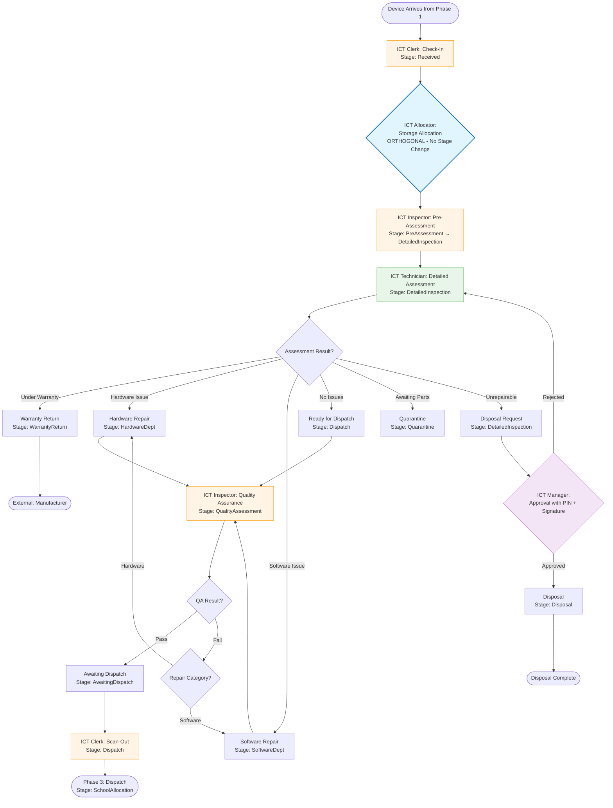

Creating a visual diagram and a structured document of the device lifecycle flow. Providing both:


[1 tool called]


Creating a visual diagram and structured document. Save this as a new file:

```markdown
# Phase 2 (ICT Center) - Complete Device Lifecycle Flow Documentation

**Version:** 2.0 (With ICT Allocator Integration)  
**Last Updated:** 2025  
**Status:** Active Implementation

---

## Table of Contents

1. [Executive Summary](#executive-summary)
2. [Visual Workflow Diagram](#visual-workflow-diagram)
3. [Actors & Roles](#actors--roles)
4. [Detailed Step-by-Step Flow](#detailed-step-by-step-flow)
5. [Stage Definitions](#stage-definitions)
6. [Data Model & Tracking](#data-model--tracking)
7. [Business Rules](#business-rules)
8. [API Endpoints Reference](#api-endpoints-reference)

---

## Executive Summary

The Phase 2 (ICT Center) workflow manages devices from receipt through assessment, repair, quality assurance, and dispatch. The introduction of the **ICT Allocator** role adds physical storage location tracking that operates independently of the workflow stages, enabling better inventory management without disrupting the assessment and repair process.

**Key Innovation:** ICT Allocator performs storage allocation **orthogonally** to workflow stages - it tracks physical location without changing device progression through the assessment/repair pipeline.

---

## Visual Workflow Diagram

### Mermaid Flowchart (Copy to Mermaid Live Editor)



### ASCII Flow Diagram

```
┌─────────────────────────────────────────────────────────────────────────┐
│                    PHASE 2 (ICT CENTER) DEVICE LIFECYCLE                │
└─────────────────────────────────────────────────────────────────────────┘

[Phase 1: Receiving] 
        │
        ▼
┌───────────────────────────────────────────────────────────────────────┐
│ STEP 1: CHECK-IN                                                      │
│ Actor: ICT Clerk                                                      │
│ Stage: Received                                                       │
│ Actions: Scan devices, verify GRV, accept stock, categorize zones     │
└───────────────────────────────────────────────────────────────────────┘
        │
        ▼
┌───────────────────────────────────────────────────────────────────────┐
│ STEP 1.5: STORAGE ALLOCATION (NEW - ORTHOGONAL)                      │
│ Actor: ICT Allocator                                                  │
│ Stage: NO CHANGE (Remains: Received or PreAssessment)                 │
│ Actions: Allocate physical location (Building/Room/Rack/Shelf/Bin)    │
│ Note: Can happen at Received OR PreAssessment stage                  │
└───────────────────────────────────────────────────────────────────────┘
        │
        ▼
┌───────────────────────────────────────────────────────────────────────┐
│ STEP 2: PRE-ASSESSMENT                                                │
│ Actor: ICT Inspector                                                  │
│ Stage: PreAssessment → DetailedInspection                             │
│ Actions: Visual/functional checks, record pass/fail                   │
└───────────────────────────────────────────────────────────────────────┘
        │
        ▼
┌───────────────────────────────────────────────────────────────────────┐
│ STEP 3: DETAILED ASSESSMENT                                           │
│ Actor: ICT Technician                                                 │
│ Stage: DetailedInspection → [Multiple Routes]                         │
│ Actions: Warranty check, repairability assessment, categorization    │
└───────────────────────────────────────────────────────────────────────┘
        │
        ├──────────────────────────────────────────────────────────────┐
        │                                                              │
        ▼              ▼              ▼              ▼              ▼
┌─────────────┐ ┌─────────────┐ ┌─────────────┐ ┌─────────────┐ ┌─────────────┐
│ Warranty    │ │ Hardware    │ │ Software    │ │ No Issues   │ │ Disposal    │
│ Return      │ │ Repair      │ │ Repair      │ │ Found       │ │ Request     │
│             │ │             │ │             │ │             │ │             │
│ Stage:      │ │ Stage:      │ │ Stage:      │ │ Stage:      │ │ Stage:      │
│ Warranty    │ │ Hardware    │ │ Software    │ │ Dispatch    │ │ Detailed    │
│ Return      │ │ Dept        │ │ Dept        │ │             │ │ Inspection  │
└─────────────┘ └─────────────┘ └─────────────┘ └─────────────┘ └─────────────┘
        │              │              │              │              │
        │              │              │              │              ▼
        │              │              │              │    ┌──────────────────┐
        │              │              │              │    │ ICT Manager:     │
        │              │              │              │    │ Approve Disposal │
        │              │              │              │    │ (PIN + Signature)│
        │              │              │              │    └──────────────────┘
        │              │              │              │              │
        │              │              │              │              ▼
        │              │              │              │    ┌──────────────────┐
        │              │              │              │    │ Stage: Disposal  │
        │              │              │              │    └──────────────────┘
        │              │              │              │
        │              └──────┬───────┴──────────────┘
        │                     │
        │                     ▼
        │         ┌──────────────────────────┐
        │         │ STEP 4: QUALITY ASSURANCE│
        │         │ Actor: ICT Inspector      │
        │         │ Stage: QualityAssessment  │
        │         │ Actions: Validate repairs,│
        │         │          run QA checklist │
        │         └──────────────────────────┘
        │                     │
        │         ┌───────────┴───────────┐
        │         │                       │
        │         ▼                       ▼
        │    ┌─────────┐          ┌──────────┐
        │    │ PASS    │          │ FAIL     │
        │    │         │          │          │
        │    │ Stage:  │          │ Stage:   │
        │    │ Awaiting│          │ Back to  │
        │    │ Dispatch│          │ Hardware │
        │    │         │          │ /Software│
        │    │         │          │ Dept     │
        │    └─────────┘          └──────────┘
        │         │                       │
        │         │                       └──────┐
        │         │                              │
        │         │                              │ (Rework Loop)
        │         │                              │
        │         ▼                              │
        │ ┌───────────────────────────────────────┘
        │ │
        │ ▼
┌───────────────────────────────────────────────────────────────────────┐
│ STEP 5: SCAN-OUT TO DISPATCH                                          │
│ Actor: ICT Clerk                                                       │
│ Stage: AwaitingDispatch → Dispatch                                     │
│ Actions: Scan devices out of ICT Center, set ScannedOutAt             │
│ Prerequisite: QaPassed = true                                         │
└───────────────────────────────────────────────────────────────────────┘
        │
        ▼
┌───────────────────────────────────────────────────────────────────────┐
│ PHASE 3: DISPATCH                                                     │
│ Actor: Dispatch Clerk                                                 │
│ Stage: SchoolAllocation                                                │
│ Actions: Create POD, Delivery Note, allocate to schools               │
└───────────────────────────────────────────────────────────────────────┘
```

---

## Actors & Roles

| Actor | Role Name | Primary Responsibilities | Workflow Steps |
|-------|-----------|-------------------------|----------------|
| **ICT Clerk** | `IctClerk` | Receiving, stock verification, scan-out to dispatch | Step 1 (Check-in), Step 5 (Scan-out) |
| **ICT Allocator** | `IctAllocator` | Physical storage location allocation | Step 1.5 (Storage Allocation) |
| **ICT Inspector** | `IctInspector` | Pre-assessment, Quality Assurance | Step 2 (Pre-Assessment), Step 4 (QA) |
| **ICT Technician** | `IctTechnician` | Detailed inspection, warranty checks, repairs, disposal requests | Step 3 (Detailed Assessment) |
| **ICT Manager** | `IctManager` | Disposal authorization (PIN + signature) | Step 3.5 (Disposal Approval) |

---

## Detailed Step-by-Step Flow

### Step 1: Check-In (ICT Clerk)

**Stage Transition:** `null` → `Received`

**Actions:**
1. ICT Clerk receives devices from Phase 1 (with GRV)
2. Scans devices against GRV
3. Verifies count matches
4. Accepts stock into ICT Center
5. Categorizes to zone: `NewStock` or `RnR`

**Data Captured:**
- `IctClerkId` - Who received the device
- `ReceivingDate` - When received
- `VerificationStatus` - Verification result (true/false)
- `Zone` - NewStock or RnR
- `Stage` - Set to `Received`

**API Endpoint:** `POST /api/phase2/receipting`

**Business Rules:**
- Devices must be receipted before appearing in assessment queues
- Duplicate serials are blocked
- GRV must exist in Phase 1

---

### Step 1.5: Storage Allocation (ICT Allocator) ⭐ NEW

**Stage Transition:** `NO CHANGE` (Orthogonal Operation)

**Timing:**
- Can happen immediately after check-in (Stage: `Received`)
- OR after pre-assessment (Stage: `PreAssessment`)
- OR at any active ICT stage (see allowed stages below)

**Actions:**
1. ICT Allocator searches device by serial
2. Views device information (school, category, current stage)
3. Allocates physical storage location:
   - Building
   - Room
   - Rack
   - Shelf
   - Bin
4. Optionally links to school's default storage location

**Data Captured:**
- `DeviceStorageLocation` record created
- `StorageLocationId` (optional - links to core location)
- `Building`, `Room`, `Rack`, `Shelf`, `Bin`
- `CreatedByUserId` - Allocator who assigned location
- `Status` - Active/Moved/Archived

**API Endpoints:**
- `GET /api/phase2/allocation/search?serial=...`
- `GET /api/phase2/allocation/locations?deviceId=...`
- `POST /api/phase2/allocation/allocate-detailed`
- `GET /api/phase2/allocation/pending` - Pending allocations queue

**Allowed Stages (Allocation Permitted):**
- ✅ `Received`
- ✅ `PreAssessment`
- ✅ `DetailedInspection`
- ✅ `HardwareDept`
- ✅ `SoftwareDept`
- ✅ `QualityAssessment`

**Blocked Stages (Allocation Not Permitted):**
- ❌ `Dispatch`
- ❌ `AwaitingDispatch`
- ❌ `Disposal`
- ❌ `SchoolAllocation`
- ❌ `WarrantyReturn` (device has left ICT)

**Business Rules:**
- **Allocation does NOT change device stage** - it's orthogonal to workflow
- One active storage location per device
- Previous allocations are marked as "Moved" when new allocation is made
- Allocation can be cleared if device is still in ICT (not disposed/dispatched)

---

### Step 2: Pre-Assessment (ICT Inspector)

**Stage Transition:** `Received` → `PreAssessment` → `DetailedInspection`

**Actions:**
1. ICT Inspector views devices in `Received` or `PreAssessment` stage
2. Performs visual/functional checks
3. Records pass/fail decision
4. Notes any attention required
5. Device automatically moves to `DetailedInspection` queue

**Data Captured:**
- `PreAssessmentPassed` - true/false
- `PreAssessmentInspectorId` - Who performed assessment
- `PreAssessmentNotes` - Assessment notes
- `AttentionRequired` - Level of attention needed
- `Stage` - Set to `DetailedInspection`

**API Endpoint:** `POST /api/phase2/assessment/pre`

**Business Rules:**
- Pre-assessment must be completed before detailed inspection
- Both passed and failed devices go to detailed inspection queue
- Technicians use `PreAssessmentPassed` and `AttentionRequired` flags to triage

---

### Step 3: Detailed Assessment (ICT Technician)

**Stage Transition:** `DetailedInspection` → [Multiple Routes]

**Actions:**
1. ICT Technician scans device
2. Checks warranty status
3. Assesses repairability
4. Categorizes issue
5. Routes device to appropriate stage

**Routing Options:**

| Category | Destination Stage | Description |
|----------|------------------|-------------|
| `WarrantyReturn` | `WarrantyReturn` | Under warranty, send to manufacturer |
| `HardwareFailure` | `HardwareDept` | Hardware repair needed |
| `SoftwareIssueUpgrade` | `SoftwareDept` | Software issues/upgrades needed |
| `NoIssuesFound` | `Dispatch` or `SchoolAllocation` | Ready for dispatch |
| `Quarantine` | `Quarantine` | Awaiting parts/software |
| `Disposal` | `DetailedInspection` (pending approval) | Unrepairable - requires manager approval |

**Data Captured:**
- `TechnicianId` - Who performed inspection
- `InspectionDate` - When inspected
- `UnderWarranty` - Warranty status
- `Repairable` - Repairability assessment
- `RepairCategory` - Category of issue
- `DisposalRequested` - If disposal requested (true/false)

**API Endpoint:** `POST /api/phase2/assessment/detailed`

**Business Rules:**
- Backend blocks if `PreAssessmentPassed == null` (pre-assessment not completed)
- Warranty devices route externally (no internal repair)
- Disposal requires manager approval (see Step 3.5)

---

### Step 3.5: Disposal Approval (ICT Manager)

**Stage Transition:** `DetailedInspection` → `Disposal` (if approved)

**Actions:**
1. Technician requests disposal (sets `DisposalRequested = true`)
2. ICT Manager reviews disposal request
3. Manager enters PIN + signature
4. System verifies PIN (hashed with SHA256)
5. Manager approves/rejects disposal
6. If approved: Device stage → `Disposal`

**Data Captured:**
- `DisposalRecord.RequestedBy` - Technician ID
- `DisposalRecord.RequestedAt` - Request timestamp
- `DisposalRecord.Reason` - Disposal reason
- `DisposalRecord.ApprovedBy` - Manager ID
- `DisposalRecord.ManagerSignature` - Manager signature
- `DisposalRecord.ManagerPinHash` - Hashed PIN (SHA256)
- `DisposalRecord.ApprovedAt` - Approval timestamp
- `DisposalRecord.IsApproved` - Approval status
- `DisposalRecord.DocumentPath` - Generated disposal document

**API Endpoints:**
- `POST /api/phase2/disposal/request` (Technician)
- `POST /api/phase2/disposal/approve` (Manager)

**Business Rules:**
- Two-step authorization required (request + approval)
- PIN is hashed before storage (never stored in plain text)
- Signature captured for audit trail
- Disposal requests for already disposed devices are blocked

---

### Step 4: Quality Assurance (ICT Inspector)

**Stage Transition:** 
- Pass: `HardwareDept`/`SoftwareDept`/`Dispatch` → `AwaitingDispatch`
- Fail: `HardwareDept`/`SoftwareDept` → Back to `HardwareDept`/`SoftwareDept` (rework)

**Actions:**
1. ICT Inspector views devices post-repair
2. Runs QA checklist
3. Records pass/fail decision
4. If pass: Device → `AwaitingDispatch`
5. If fail: Device → Back to repair department (rework)

**Data Captured:**
- `QaPassed` - true/false
- `QaInspectorId` - Who performed QA
- `ReworkCount` - Incremented on failure
- `QualityRecord` - Full QA record with attempt number

**API Endpoint:** `POST /api/phase2/quality`

**Routing on Failure:**
- If `RepairCategory = HardwareFailure` → `HardwareDept`
- If `RepairCategory = SoftwareIssueUpgrade` → `SoftwareDept`
- Default → `HardwareDept`

**Business Rules:**
- Failures increment `ReworkCount`
- Repeated failures may trigger disposal request
- Only devices that pass QA can be scanned out

---

### Step 5: Scan-Out to Dispatch (ICT Clerk)

**Stage Transition:** `AwaitingDispatch` → `Dispatch`

**Actions:**
1. ICT Clerk views devices ready for dispatch (`AwaitingDispatch` stage)
2. Selects/scans devices to scan out
3. System validates: `QaPassed = true`
4. System sets scan-out timestamp and user
5. Device stage → `Dispatch`

**Data Captured:**
- `ScannedOutAt` - When scanned out
- `ScannedOutByUserId` - Who scanned out
- `Stage` - Set to `Dispatch`

**API Endpoint:** `POST /api/phase2/dispatch/scan-out`

**Business Rules:**
- Device must have `QaPassed = true` before scan-out
- Only devices in `AwaitingDispatch` stage can be scanned out
- Scan-out moves device to `Dispatch` stage
- Device is now ready for Phase 3 (Dispatch Clerk creates POD)

---

## Stage Definitions

| Stage | Description | Next Possible Stages | Allocation Allowed? |
|-------|-------------|---------------------|---------------------|
| `Received` | Device checked in by ICT Clerk | `PreAssessment` | ✅ Yes |
| `PreAssessment` | Awaiting pre-assessment by Inspector | `DetailedInspection` | ✅ Yes |
| `DetailedInspection` | Awaiting detailed assessment by Technician | `HardwareDept`, `SoftwareDept`, `WarrantyReturn`, `Dispatch`, `Quarantine`, `Disposal` | ✅ Yes |
| `HardwareDept` | In hardware repair department | `QualityAssessment`, `HardwareDept` (rework) | ✅ Yes |
| `SoftwareDept` | In software repair department | `QualityAssessment`, `SoftwareDept` (rework) | ✅ Yes |
| `QualityAssessment` | Awaiting QA by Inspector | `AwaitingDispatch`, `HardwareDept`, `SoftwareDept` | ✅ Yes |
| `AwaitingDispatch` | Passed QA, ready for scan-out | `Dispatch` | ❌ No (ready to leave) |
| `Dispatch` | Scanned out by ICT Clerk | `SchoolAllocation` (Phase 3) | ❌ No (left ICT) |
| `SchoolAllocation` | Allocated to POD in Phase 3 | N/A (Phase 3) | ❌ No (left ICT) |
| `WarrantyReturn` | Sent to manufacturer | N/A (External) | ❌ No (left ICT) |
| `Quarantine` | Awaiting parts/software | `HardwareDept`, `SoftwareDept` | ✅ Yes |
| `Disposal` | Approved for disposal | N/A (Final) | ❌ No (disposed) |

---

## Data Model & Tracking

### Phase2Device (Main Entity)

**Workflow Tracking Fields:**

| Field | Purpose | Set By | Stage |
|-------|---------|--------|-------|
| `Stage` | Current workflow stage | System | All stages |
| `Zone` | NewStock or RnR | ICT Clerk | Received |
| `IctClerkId` | Who checked in | ICT Clerk | Received |
| `ReceivingDate` | Check-in date | ICT Clerk | Received |
| `PreAssessmentPassed` | Pre-assessment result | Inspector | PreAssessment |
| `PreAssessmentInspectorId` | Pre-assessment inspector | Inspector | PreAssessment |
| `TechnicianId` | Assessment technician | Technician | DetailedInspection |
| `UnderWarranty` | Warranty status | Technician | DetailedInspection |
| `Repairable` | Repairability | Technician | DetailedInspection |
| `RepairCategory` | Issue category | Technician | DetailedInspection |
| `QaPassed` | QA result | Inspector | QualityAssessment |
| `QaInspectorId` | QA inspector | Inspector | QualityAssessment |
| `ReworkCount` | Number of QA failures | System | QualityAssessment |
| `ScannedOutAt` | Scan-out timestamp | ICT Clerk | Dispatch |
| `ScannedOutByUserId` | Who scanned out | ICT Clerk | Dispatch |

### DeviceStorageLocation (Allocation Entity)

**Physical Location Tracking:**

| Field | Purpose | Set By |
|-------|---------|--------|
| `Phase2DeviceId` | Links to device | System |
| `StorageLocationId` | Core location reference | ICT Allocator |
| `Building` | Building identifier | ICT Allocator |
| `Room` | Room identifier | ICT Allocator |
| `Rack` | Rack identifier | ICT Allocator |
| `Shelf` | Shelf identifier | ICT Allocator |
| `Bin` | Bin identifier | ICT Allocator |
| `Status` | Active/Moved/Archived | System |
| `CreatedByUserId` | Who allocated | ICT Allocator |
| `CreatedAt` | Allocation timestamp | System |

**Key Relationship:**
- `DeviceStorageLocation` is **independent** of `Phase2Device.Stage`
- One device can have multiple storage location records (history)
- Only one record has `Status = "Active"` at a time

---

## Business Rules

### Allocation Rules

1. **Orthogonal Operation**: Storage allocation does NOT change device stage
2. **Early Pipeline**: Allocation happens early (Received or PreAssessment stages)
3. **Stage Validation**: Allocation only allowed in active ICT stages
4. **Blocked Stages**: Allocation blocked when device has left ICT (Dispatch, Disposal, etc.)
5. **One Active Location**: Only one active storage location per device
6. **Location History**: Previous allocations marked as "Moved" when new allocation created

### Workflow Rules

1. **Sequential Progression**: Devices must progress through stages in order
2. **Pre-Assessment Required**: `PreAssessmentPassed` must be set before detailed inspection
3. **QA Required**: `QaPassed = true` required before scan-out
4. **Rework Tracking**: QA failures increment `ReworkCount` and route back to repair
5. **Disposal Authorization**: Two-step process (request + manager approval with PIN)
6. **Audit Trail**: All actions logged with user, timestamp, device serial, and details

### Data Integrity Rules

1. **No Duplicates**: Serial numbers must be unique in Phase 2
2. **GRV Validation**: GRV must exist in Phase 1 before receipting
3. **School Linking**: Devices linked to schools via `SchoolId` and `SchoolName`
4. **Stage Consistency**: Stage transitions validated by backend services

---

## API Endpoints Reference

### Receipting (ICT Clerk)

| Endpoint | Method | Purpose |
|----------|--------|---------|
| `/api/phase2/receipting` | POST | Create receipt, check-in devices |
| `/api/phase2/receipting/pending-grvs` | GET | List pending GRVs for receipting |

### Allocation (ICT Allocator)

| Endpoint | Method | Purpose |
|----------|--------|---------|
| `/api/phase2/allocation/search?serial=...` | GET | Search device by serial |
| `/api/phase2/allocation/locations?deviceId=...` | GET | Get available locations for device |
| `/api/phase2/allocation/allocate-detailed` | POST | Allocate storage with detailed location |
| `/api/phase2/allocation/pending` | GET | Get pending allocations queue |
| `/api/phase2/allocation/storage-overview` | GET | Get storage overview by location |
| `/api/phase2/allocation/unallocated` | GET | Get unallocated devices |
| `/api/phase2/allocation/schools-in-storage` | GET | Get schools with devices in storage |
| `/api/phase2/allocation/clear` | POST | Clear storage allocation |

### Assessment (Inspector & Technician)

| Endpoint | Method | Purpose |
|----------|--------|---------|
| `/api/phase2/assessment/pre` | POST | Pre-assessment by Inspector |
| `/api/phase2/assessment/detailed` | POST | Detailed assessment by Technician |
| `/api/phase2/assessment/detailed/{deviceId}` | GET | Get detailed assessment data |

### Quality Assurance (Inspector)

| Endpoint | Method | Purpose |
|----------|--------|---------|
| `/api/phase2/quality` | POST | Quality assessment by Inspector |

### Disposal (Technician & Manager)

| Endpoint | Method | Purpose |
|----------|--------|---------|
| `/api/phase2/disposal/request` | POST | Request disposal (Technician) |
| `/api/phase2/disposal/approve` | POST | Approve disposal (Manager) |
| `/api/phase2/disposal/pending` | GET | Get pending disposal requests |

### Dispatch (ICT Clerk)

| Endpoint | Method | Purpose |
|----------|--------|---------|
| `/api/phase2/dispatch/ready` | GET | Get devices ready for dispatch |
| `/api/phase2/dispatch/scan-out` | POST | Scan out devices to dispatch |
| `/api/phase2/dispatch/scanout/by-serial` | POST | Scan out by serial number |
| `/api/phase2/dispatch/scanout/by-id` | POST | Scan out by device ID |

### Device Queries (All Roles)

| Endpoint | Method | Purpose |
|----------|--------|---------|
| `/api/phase2/devices/{id}` | GET | Get device by ID |
| `/api/phase2/devices?stage=...&zone=...` | GET | Query devices by stage/zone |

---

## Workflow Summary Table

| Step | Actor | Stage Before | Stage After | Allocation Timing | Key Data |
|------|-------|--------------|-------------|-------------------|----------|
| 1. Check-In | ICT Clerk | null | Received | After this step | IctClerkId, ReceivingDate, Zone |
| 1.5. Allocation | ICT Allocator | Received/PreAssessment | **NO CHANGE** | Right after check-in OR after pre-assessment | Building, Room, Rack, Shelf, Bin |
| 2. Pre-Assessment | ICT Inspector | Received | DetailedInspection | Can allocate here too | PreAssessmentPassed, PreAssessmentInspectorId |
| 3. Detailed Assessment | ICT Technician | DetailedInspection | HardwareDept/SoftwareDept/WarrantyReturn/Dispatch/Quarantine/Disposal | Can allocate during repair | TechnicianId, UnderWarranty, RepairCategory |
| 3.5. Disposal Approval | ICT Manager | DetailedInspection | Disposal | N/A (blocked) | ManagerSignature, ManagerPinHash |
| 4. Quality Assurance | ICT Inspector | HardwareDept/SoftwareDept/Dispatch | AwaitingDispatch (pass) or back to repair (fail) | Can allocate during QA | QaPassed, QaInspectorId, ReworkCount |
| 5. Scan-Out | ICT Clerk | AwaitingDispatch | Dispatch | N/A (blocked - leaving ICT) | ScannedOutAt, ScannedOutByUserId |

---

## Key Design Decisions

1. **Orthogonal Allocation**: Storage allocation operates independently of workflow stages, enabling flexible inventory management without disrupting assessment/repair flow.

2. **Early Pipeline Integration**: Allocation happens early (Received/PreAssessment) to establish physical location tracking from the start.

3. **Stage Validation**: Allocation is blocked when devices leave ICT (Dispatch, Disposal, etc.) to maintain data integrity.

4. **Dual Model Approach**: 
   - Core `StorageLocation` for high-level zone tracking
   - Phase 2 `DeviceStorageLocation` for detailed physical location (Building/Room/Rack/Shelf/Bin)

5. **Backward Compatibility**: Existing workflow continues unchanged; allocation is additive functionality.

---

## Notes for Implementation

- All allocation operations are logged in audit trail
- Storage location history is maintained (Status: Active/Moved/Archived)
- Allocation can be updated/moved as device progresses through stages
- Allocation is cleared automatically when device leaves ICT (optional feature)
- Pending allocations queue shows devices needing storage assignment (priority: Received/PreAssessment stages)

---

**Document End**
```

This document includes:
1. Visual diagrams (Mermaid and ASCII)
2. Step-by-step flow with actors, stages, and data
3. Stage definitions and transitions
4. Data model reference
5. Business rules
6. API endpoints reference
7. Summary tables

